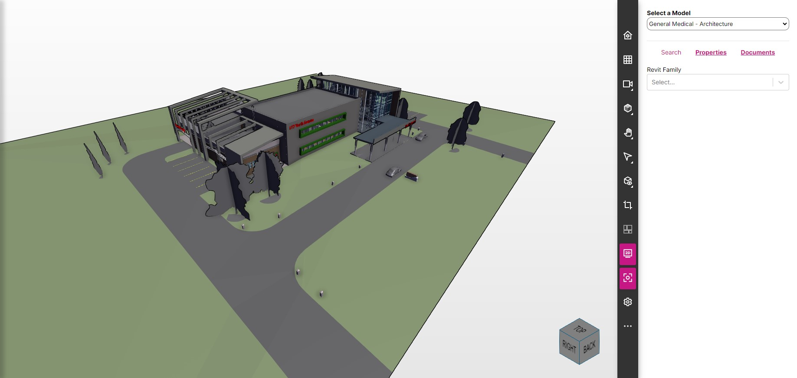
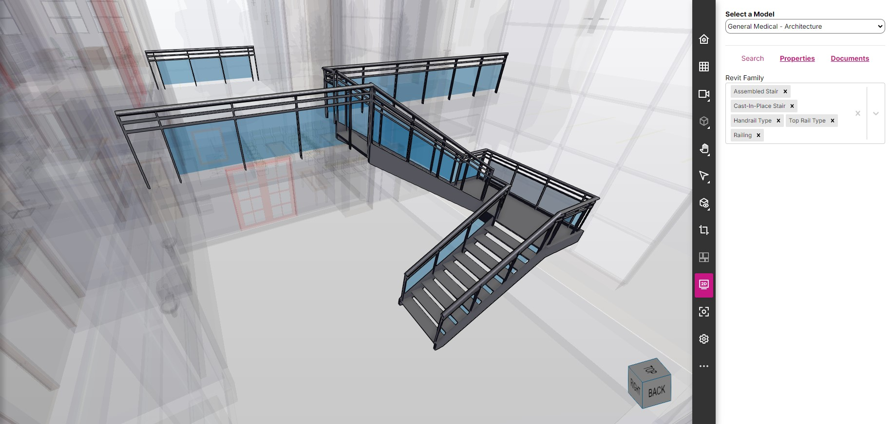
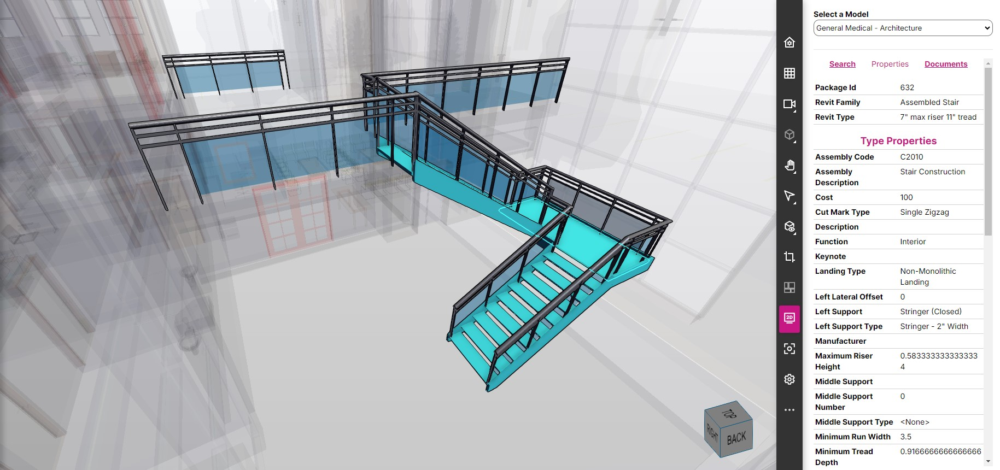

# Model Doc View Redux pageComponent


The ModelDocViewRedux pageComponent builds on the ModelDocView pageComponent to show how a complex pageComponent can use ipa-core's ability to load custom redux slices and manage and use state at an application level. All state managed via React Context in ModelDocView has been elevated to Redux in ModelDocViewRedux. Some other code reorganization also has been done to take advantage of state in redux; such as moving the FloatingDocViewer out of the FilePanel and to the pageComponent itself, allowing the Search or Properties tab to be chosen and the doc viewer to remain open at the same time.

This page is written for use with Revit models, but can be easily modified for other CAD authoring applications.

You are free to take the pageComponent and modify for your own purposes and, as with all digitaltwin-factory content, is available under the [Apache 2.0 License](../../LICENSE).

## Requirements

In order to use the ModelDocView, your ipa-core application must be using ipa-core 3.0 or newer and the @dtplatform 4.3 or newer libraries.

If using the ```create-twinit-app``` npx command to scaffold a new client project for ipa-core, be sure to use the a ```create-twinit-app``` version of 3.0.6 or newer. You can check the version of create-twinit-app that created your current project by going into your project's package.json and finding the dev_twinit field.

* If you do not have a dev_twinit field in your package.json then your project was created using a version prior to 3.0.7.
* If you have a dev_twinit field, check the version number in the createdBy field. It will contain a version like: create-twinit-app@3.0.7.

In order to view 3D/2D models you must also have created an import orchestrator, uploaded a bimpk or sgpk, and used the import orchestrator to import the bmpk or sgpk contents into Twinit. The 'Self-Led Developer Training Intermediate' course on Twinit Academy has a lesson titled 'Importing and Managing Models' which walks you through all three of those steps.

If you have the import orchestrator already created and would like to be able to easily upload and import new versions of bmpks or new bimpks, consider implementing the [SimpleModelImportView pageComponent](../modelImport/README.md). There is a sample bimpk provided there as well.

Plugins for supported CAD applications that can be used to upload bimpks of your own models can downloaded from [the Twinit plugins page](https://apps.invicara.com/ipaplugins/).

## Adding ModelDocView to Your Application

### Webpack and script updates to your application

If you used a version of create-twinit-app of 3.0.6 or newer you can skip this step. Otherwise, follow the directions [here](https://twinit.dev/docs/apis/viewer/IafViewerDBM) for updating your webpack configuration and adding the viewer script tag.

### Adding the Redux Slices

1. Copy the ```redux/documentsSlice.js``` and the ```redux/modelSlice.js``` files from this folder
2. Paste both files in to your ```app/ipaCore/redux``` folder
3. Open ```app/ipaCore/ipaCore.js``` and add the following to your redux configuration
```js
redux: {
   slices: [
      { name: 'documentsSlice', file: 'documentsSlice.js' },
      { name: 'modelSlice', file: 'modelSlice.js' }
   ]
},
```

### Adding the pageComponent

To add the pageComponent to your application:

1. Copy the ```pageComponents/modelDocViewerRedux``` folder and its contents from this folder
2. Paste the folder in to your ```app/ipaCore/pageComponents``` folder

### Configuring the ModelDocViewRedux

Add the following to your handlers:

```json
"modelDocViewRedux": {
   "title": "Redux Enabled Model Doc View",
   "icon": "fas fa-building fa-2x",
   "shortName": "modeldocviewredux",
   "description": "Redux Enabled Model Doc View",
   "pageComponent": "modelDocViewerRedux/ModelDocViewRedux",
   "path": "/modeldocviewredux",
   "config": {}
}
```

Add the page to your groupedPages so it shows up in the app navigation. An example is below:

```json
"model": {
   "icon": "fas fa-building fa-2x",
   "position": 1,
   "pages": [
      {
         "page": "Redux Enabled Model Doc View",
         "handler": "modelDocViewRedux"
      }
   ]
}
```

## Using the ModelDocView

1. Select an imported model in the 'Select a Model' dropdown.

The viewer will then appear on the left of the page and begin loading the model in the viewer.



2. Optionally, select one or more Revit families in the Search panel. Note, that you can type to search in the dropdown.

The view will update to display elements of those families as rendered against the rest of the model in glass mode.



3. Click on a model element in the view and select Properties to see the element's model properties.



4. Select Documents.

Any documents that have been uploaded and related to the selected model element, will appear in the Related File list.

5. To view a file, check the box next to its name. You can check multiple boxes and open more than one file at a time.


6. To upload a new file and relate it to the model element click the 'Upload File' button and select a file on disk. After it has been uploaded and related to the model element, it will appear in the Related Files list.